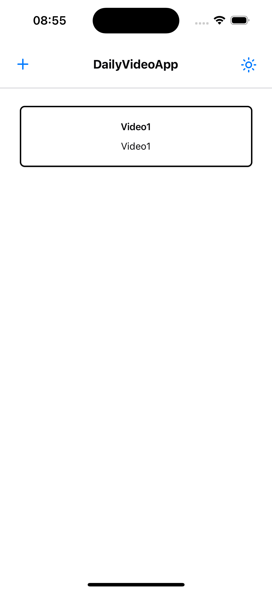
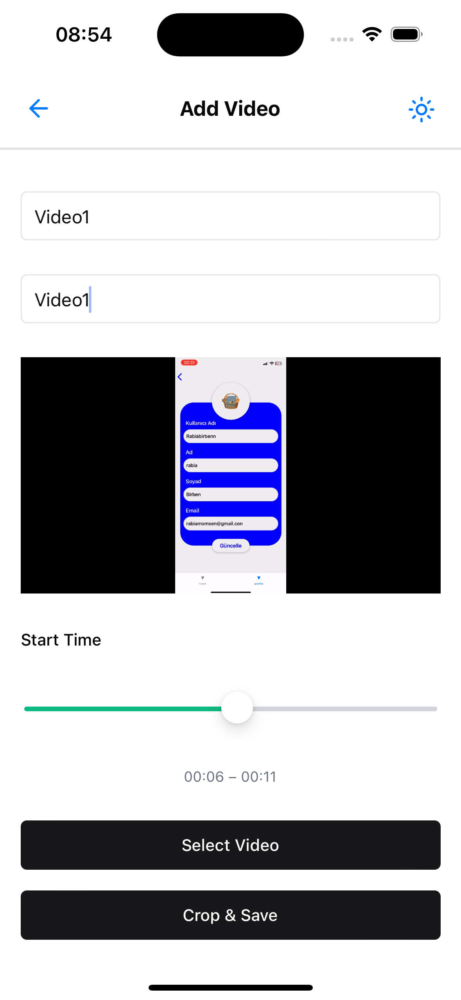

# 📽️ Project Name

DailyVideoApp

[🔗 View on GitHub](https://github.com/atakanotur/DailyVideoApp)

---

## 📝 Project Description

DailyVideoApp is a simple and modern mobile application that allows users to document their daily life through short video entries. Users can select a video from their device, trim a 5-second segment, add a title and description, and save it to their personal video diary. This app is perfect for those who want to create short and meaningful memories using just their smartphone.

---

## 🛠️ Technologies Used

- **React Native (Expo)** – Mobile development framework
- **expo-video** – Video playback and control
- **FFmpegKit** – Video trimming and processing
- **Zustand** – Global state management
- **TanStack Query** – Async data and mutation management
- **React Hook Form + Zod** – Form validation and schemas
- **NativeWind** – Tailwind-based styling for React Native
- **FlashList** – High-performance list rendering (Shopify)
- **React Navigation (expo-router)** – Routing and screen navigation

---

### Additional Setup

#### 📚 FFmpeg Installation Resources

- [How to Run FFmpegKit for React Native iOS After Deprecation](https://dev.to/shaquille_hinds_cd216994c/how-to-run-ffmpeg-kit-for-react-native-ios-after-deprecation-1bgc)
- [Using FFmpegKit Locally in React Native After Retirement](https://dev.to/utkarsh4517/using-ffmpegkit-locally-in-react-native-after-retirement-3a9p)

## 🚀 Installation

```bash
# Clone FFmpegKit repository (must be in the same directory)
git clone https://github.com/arthenica/ffmpeg-kit.git

# Clone the main project repository
git clone https://github.com/atakanotur/DailyVideoApp

cd DailyVideoApp
```

### Additional Setup

#### macOS Users (required for building FFmpegKit locally)

```bash
brew install automake libtool pkg-config
brew reinstall autoconf

# Build the FFmpegKit iOS framework
cd ffmpeg-kit
./ios.sh -x --disable-arm64e

# Then navigate to the local FFmpegKit React Native module
cd react-native
```

#### Update the `ffmpeg-kit-react-native.podspec` file

Make sure it looks like this (adjust the dependency name if needed):

```ruby
require "json"

package = JSON.parse(File.read(File.join(__dir__, "package.json")))

Pod::Spec.new do |s|
  s.name         = package["name"]
  s.version      = package["version"]
  s.summary      = package["description"]
  s.homepage     = package["homepage"]
  s.license      = package["license"]
  s.authors      = package["author"]

  s.platform          = :ios
  s.requires_arc      = true
  s.static_framework  = true

  s.source = { :git => 'https://github.com/arthenica/ffmpeg-kit.git', :tag => s.version.to_s }

  s.dependency "React-Core"

  s.source_files      = '**/FFmpegKitReactNativeModule.m',
                        '**/FFmpegKitReactNativeModule.h'

  s.dependency 'daily-video-app-ffmpeg-kit-ios-https'

  s.ios.deployment_target = '12.1'
end
```

#### iOS Podfile Configuration

After running `npx expo prebuild`, an `ios/Podfile` will be generated. Edit the `Podfile` as shown below:

```ruby
target 'DailyVideoApp' do
  pod 'daily-video-app-ffmpeg-kit-ios-https', :path => '..'

  # Comment out or remove this line if it exists:
  # pod 'ffmpeg-kit-react-native', :subspecs => ['audio'], :podspec => '../node_modules/ffmpeg-kit-react-native/ffmpeg-kit-react-native.podspec'

  # Rest of your Podfile...
end
```

#### Final Step

After completing the above setup, return to your main project directory and run the following commands:

```bash
# Install node dependencies
npm install

# Navigate to the iOS folder and install CocoaPods dependencies
cd ios
pod install
```

Once this is complete, you can return to the root directory and launch the app:

```bash
cd ..
npx expo run:ios
```

```bash
npx expo prebuild
```

---

## 🔧 Usage

1. Launch the app.
2. Select a video from your device.
3. Choose a 5-second segment from the video.
4. Add a title and description to the segment.
5. The video segment is trimmed and saved.

[Include screenshots or demo link if available]






---
